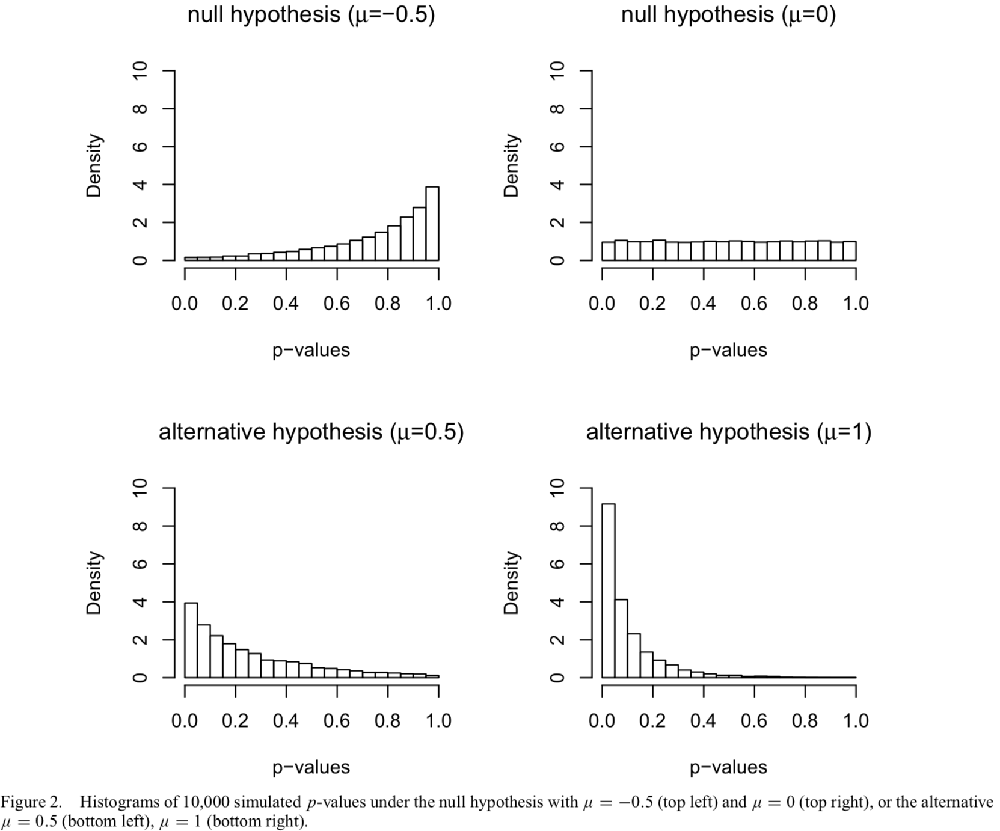
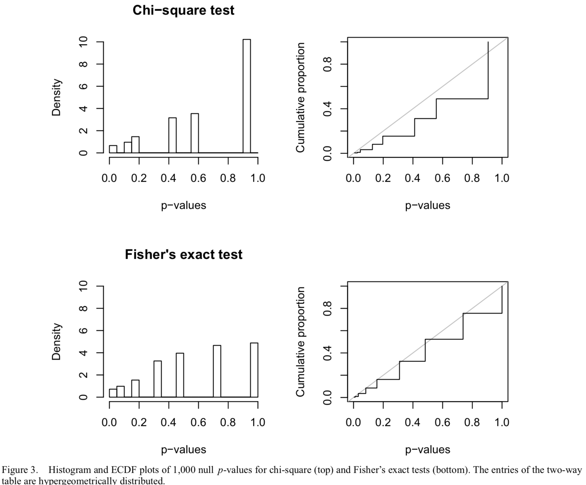
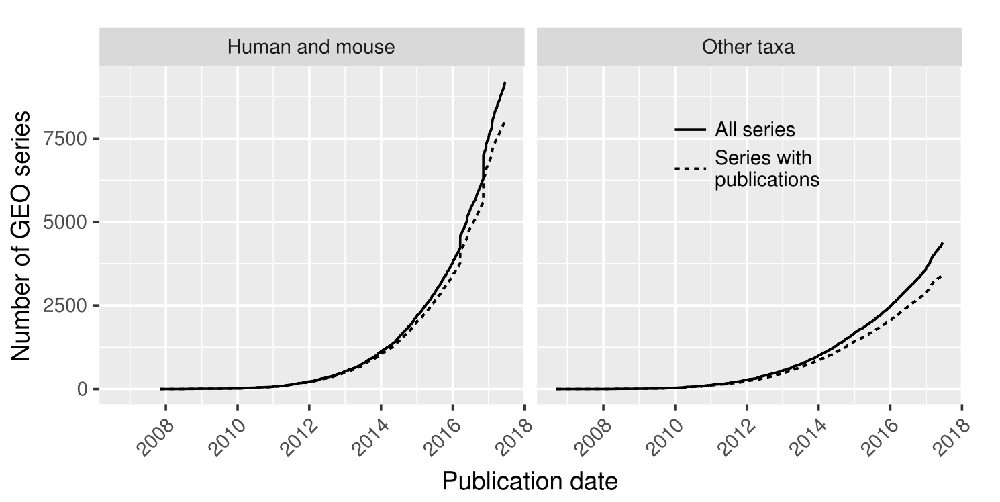
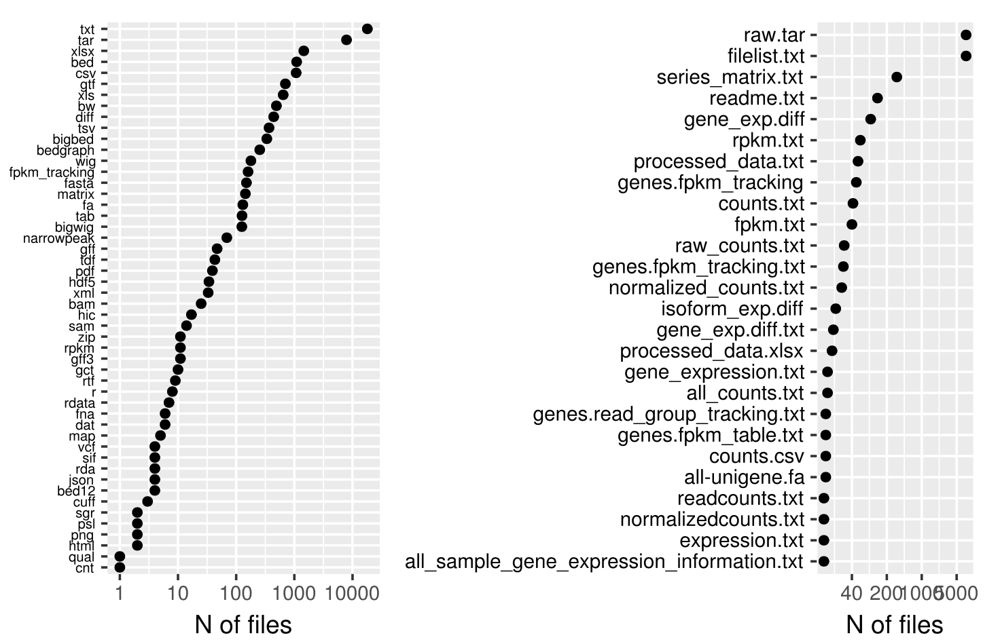
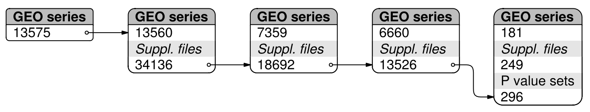
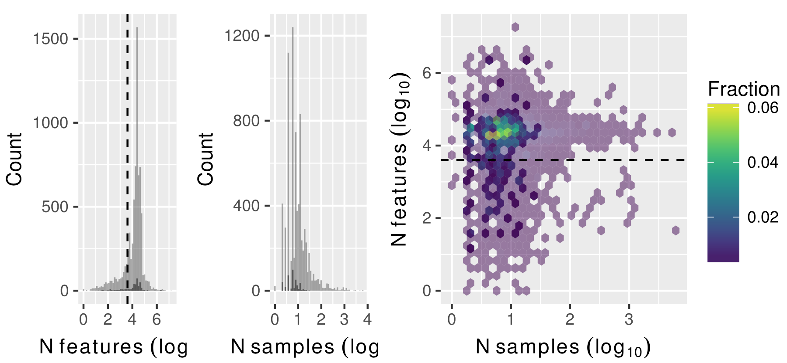
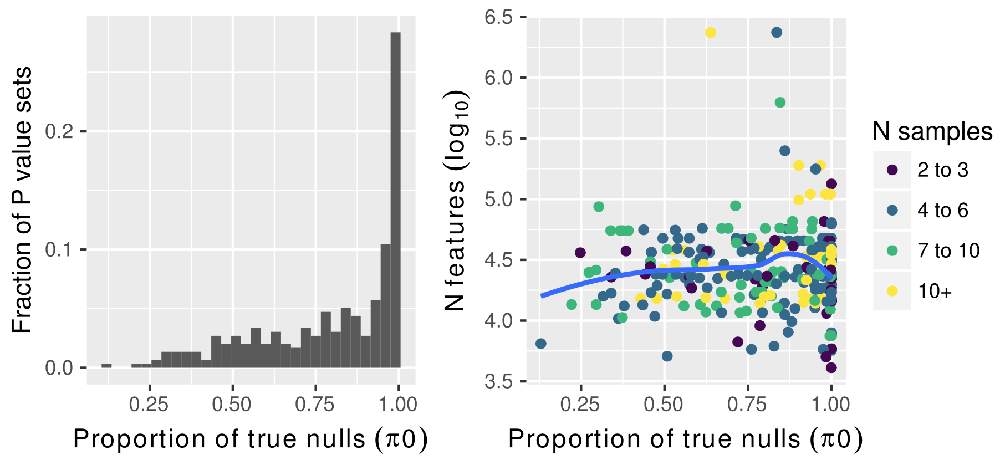
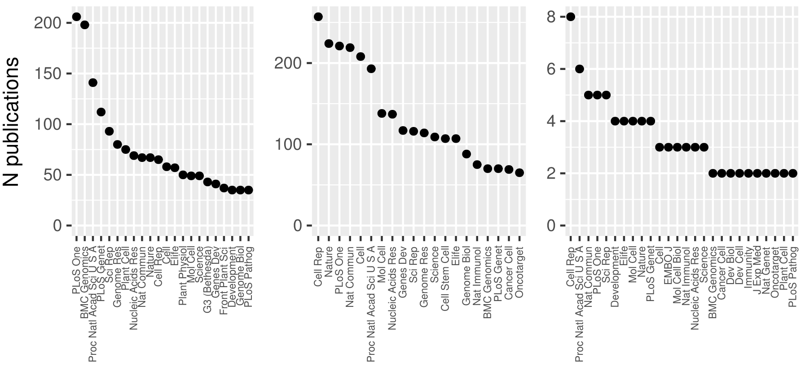
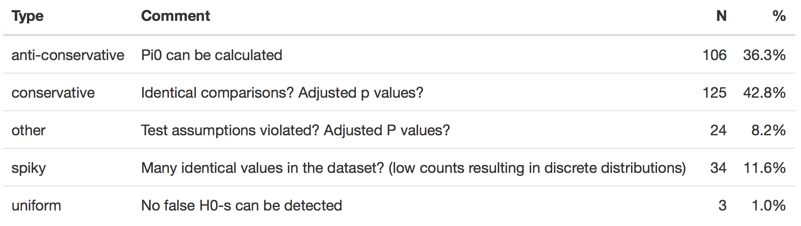
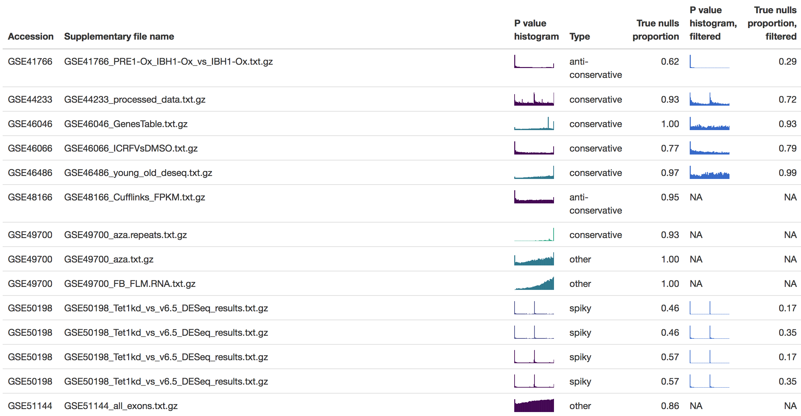

class: inverse, middle, center

```{r setup, include=FALSE}
options(htmltools.dir.version = FALSE)
library(tidyverse)
```

# Introduction

---

## Signal vs noise

- Making discoveries is technically dependent on the ability of our methods to identify signal from overhelming amount of noise

- This pertains also in case of omics experiments (eg. gene expression analysis, proteomics) when thousands of measurements and hypotheses are made and tested in parallel

- Small proportion of found effects are real and scientifically interesting. How to sort out real effects from false positives?     

- To keep false positive discoveries under control different multiple comparison adjustments of P values are used (eg. Bonferroni), in case of omics experiments less conservative approaches are **FDR** and **qvalues**. 

- In order to use FDR and qvalues, p values should come from continuous distribution with "flat" shape

---

## Reckless use of P values leads to poor replicability

- Poor replicability<sup>1</sup> and reproducibility<sup>2</sup> have become major concerns in experimental biomedical science   

- There are two major hurdles in the replication: 
    1. the high cost of actually repeating experiments and 
    1. lack of consensus on how to measure replicability   
    
- This makes it desirable to first estimate *in silico*, which studies are worth replicating in the lab, and how to best replicate them

.footnote[[1] Replicability: reproducing the original data approximately by doing new experiment. [2] Reproducibility: exact repeating of an analysis using original data. Successful reproduction does not generate new evidence in support or against of scientific hypothesis.]

---

## QC checklist

1. Reproducibility: is data usable for reanalysis? (deposition to a public
database)

1. Compliance with GEO database submission requirements?

1. How many of the GEO submissions provide p value tables?

1. P histograms – how many experiments are poorly designed/analysed?

---

class: inverse, middle, center

# P values

---

## P values have uniform distribution

- P values were designed to follow uniform distribution in order control the number of false positive discoveries (type-I error rate)

--

- Under the null hypothesis, test statistic T has the distribution $F(t)$ (eg. standard normal). p-value $P = F(T)$ has a [probability distribution](https://stats.stackexchange.com/questions/10613/why-are-p-values-uniformly-distributed-under-the-null-hypothesis#10617): 
$$Pr(P<p) = Pr(F(T)<p) = Pr(T<F^{-1}(p)) = F(F^{-1}(p)) = p$$

--

- The p-value is uniformly distributed:
      - when the null hypothesis is true
      - test statistic comes from continuous distribution

> "The whole point of using the correct distribution (normal, t, f, chisq, etc.) is to transform from the test statistic to a uniform p-value. If the null hypothesis is false then the distribution of the p-value will (hopefully) be more weighted towards 0." ['Greg snow'](https://stats.stackexchange.com/a/10617)
---

## Test statistic from continuous distribution

Shape of the distribution is not influenced by your hypothesis but parameters ([Murdoch, 2008](https://www.tandfonline.com/doi/abs/10.1198/000313008X332421))

$$H_0: \mu \le 0 \\ H_a: \mu \gt 0$$

```{r, echo=FALSE, out.width='60%', fig.align='center'}

```

---

## Test statistic from discrete distribution

P value distribution is not uniform anymore (eg. contingency table) and cannot be used for FDR adjustment..

```{r, echo=FALSE, out.width='60%', fig.align='center'}

```

---

## Distribution of P values 

```{r, echo=FALSE, fig.align='center'}
h1 <- replicate(200, t.test(rnorm(3, 1, 0.3))$p.value)
ggplot(data = data_frame(h0 = runif(2000), h1 = c(h1, runif(1800)))) +
  geom_histogram(aes(h1), bins = 30, center = 0.5) +
  geom_histogram(aes(h0), bins = 30, center = 0.5, fill = "gray", alpha = 0.7) +
  labs(x = "P väärtus", 
       y = "N",
       caption = "Hall, kui nullhüpotees kehtib, tõelisi efekte ei ole. Must, 10% tõelisi efekte ja statistiline jõud 80%.")
```

---

background-image: url(http://varianceexplained.org/figs/2014-12-15-interpreting-pvalue-histogram/plot_melted-1.png)
class: center, bottom

.footnote[
Pilt: Typical P value histograms 
@[Variance explained](http://varianceexplained.org/statistics/interpreting-pvalue-histogram/).
]

???

Image credit: [Variance explained](http://varianceexplained.org/statistics/interpreting-pvalue-histogram/)

---

background-image: url(img/ncbi-geo.png)
background-size: cover
class: middle, center


# HT-seq datasets at Entrez GEO database

---

## GEO series submission dynamics and associated publications of HT-seq data

- We queried the NCBI GEO database for `"expression profiling by high throughput sequencing"`
- Query retrieved 13575 datasets
- First HT-seq data set was submitted to GEO database at 2006-09-08
- 68% of GEO data sets (9194) contain data from mouse or human origin 

```{r, echo=FALSE, out.width='60%', fig.align='center'}

```

---

## GEO data submission rules

- We sought to determine the compliance with the formal requirements for GEO data submission (https://www.ncbi.nlm.nih.gov/geo/info/seq.html)    

- This pertains to the reproducibitly of data analysis    

- GEO archive has three required components   
    1. metadata, 
    1. processed data, and 
    1. raw data
        
---

## Publications and supplementary files

- 88% of human and mouse data sets are linked to their primary publication. 
- The proportion of datasets with publications is lower when other taxa are used as model organisms 78%
      
- Almost all GEO datasets (13560/13575) contain supplementary files

- The data sets lacking public supplementary files nevertheless show 73% publication rate which is similar to data sets with supplementary files


---

### Filename extensions and supplementary file names

- RAW.tar files are included in 57% (7722) of GEO series, whereas only RAW.tar and filelist.txt is present in 46% (6201) GEO series
- 'RAW.tar' archive contains one file per sample and samples can be directly mapped to metadata by using sample name
- Other common files contain annotations ‘readme.txt’ and processed data: commonly sequence read counts, gene expression analysis results or ChIP-Seq peak counts

```{r, echo=FALSE, out.width='75%', fig.align='center'}

```

---

## Which supplementary files contain P values?

- Downloading all 34136 GEO supplementary files was not practical

- Sequence read counts can be either as raw read counts or normalised read counts
      - Gene expression analysis of HT-seq data is commonly performed by fitting models to discrete sequence read count data
      - Normalised sequence read counts are used for plotting and visual evaluation of the analysis results, but cannot be used to directly reproduce gene expression analysis

- To reduce number of files to be downloaded from GEO database, based on file extensions and filenames, we excluded from the dataset files that most plausibly don’t contain final processed data in a tabular format, such as binary files, annotations, raw data, graphics, and other non tabular files 

---

## Filter

- Filetype filter reduced the number of files by 60% and GEO series by 51%   
- Resulting dataset consisted of 13526 files from 6660 GEO series to be downloaded    

```{r, echo=FALSE, fig.align='center'}

```

.footnote[Arrows from left to right, (1) GEO sets with supplementary files, (2) filter out RAW.tar and filelist.txt files from supplementary file names, (3) supplementary files with flat table formats that were downloaded, (4) tables with p values. Number of p value sets is the number of sets with >4000 features.]

---

class: inverse, middle, center

# Results

---

## Number of samples and features of HT-seq experiments

- Mean number of samples was 27 and median 8. Most frequent sample size was 6     

- Mean number of features was 41935 and median 21899     

```{r, echo=FALSE, fig.align='center'}

```

---

## Proportion of true null hypotheses in P value sets

```{r, echo=FALSE, fig.align='center'}

```

- The number of [direct target genes of Myc](http://journals.plos.org/plosone/article?id=10.1371/journal.pone.0001798) in human cells totals approximately 16% of all human genes
- [p53 has 346-399 validated target genes](https://www.nature.com/articles/onc2016502) (up to 3500, based on HT experiments)
- The number of high confidence $\beta$-[catenin target genes is 193](https://bmcgenomics.biomedcentral.com/articles/10.1186/1471-2164-15-74) (up to 1501 and 2389 genes)
---

## Top journals publishing HT-seq data

```{r, echo=FALSE, fig.align='center'}

```

---

## Citations versus the number of true nulls

```{r, echo=FALSE, fig.align='center'}
knitr::include_graphics("img/fig9.png")
```

---

##  P value histogram types

```{r, echo=FALSE, fig.align='center'}

```

---

## Filtering non-informative features

```{r, echo=FALSE, fig.align='center'}

```

- [Tabel](spark.html)

---

## Conclusions

- Better reporting of HT-seq experiments analysis artefacts is needed and will improve reproducibility
- Based on available P value histograms, about 2/3 of experiments display deficencies in experiment design or statistical analysis
- Filtering out low expression level non-informative features is simplest way to fix or improve staistical inference in omics experiments 
- Reporting full sets of raw P value histograms should be compulsory when publishing omics experiment results

---

background-image: url(https://upload.wikimedia.org/wikipedia/commons/b/be/Sharingan_triple.svg)

<a href="https://github.com/tpall/mat-looduses" class="github-corner" aria-label="View source on Github"><svg width="80" height="80" viewBox="0 0 250 250" style="fill:#151513; color:#fff; position: absolute; top: 0; border: 0; right: 0;" aria-hidden="true"><path d="M0,0 L115,115 L130,115 L142,142 L250,250 L250,0 Z"></path><path d="M128.3,109.0 C113.8,99.7 119.0,89.6 119.0,89.6 C122.0,82.7 120.5,78.6 120.5,78.6 C119.2,72.0 123.4,76.3 123.4,76.3 C127.3,80.9 125.5,87.3 125.5,87.3 C122.9,97.6 130.6,101.9 134.4,103.2" fill="currentColor" style="transform-origin: 130px 106px;" class="octo-arm"></path><path d="M115.0,115.0 C114.9,115.1 118.7,116.5 119.8,115.4 L133.7,101.6 C136.9,99.2 139.9,98.4 142.2,98.6 C133.8,88.0 127.5,74.4 143.8,58.0 C148.5,53.4 154.0,51.2 159.7,51.0 C160.3,49.4 163.2,43.6 171.4,40.1 C171.4,40.1 176.1,42.5 178.8,56.2 C183.1,58.6 187.2,61.8 190.9,65.4 C194.5,69.0 197.7,73.2 200.1,77.6 C213.8,80.2 216.3,84.9 216.3,84.9 C212.7,93.1 206.9,96.0 205.4,96.6 C205.1,102.4 203.0,107.8 198.3,112.5 C181.9,128.9 168.3,122.5 157.7,114.1 C157.9,116.9 156.7,120.9 152.7,124.9 L141.0,136.5 C139.8,137.7 141.6,141.9 141.8,141.8 Z" fill="currentColor" class="octo-body"></path></svg></a><style>.github-corner:hover .octo-arm{animation:octocat-wave 560ms ease-in-out}@keyframes octocat-wave{0%,100%{transform:rotate(0)}20%,60%{transform:rotate(-25deg)}40%,80%{transform:rotate(10deg)}}@media (max-width:500px){.github-corner:hover .octo-arm{animation:none}.github-corner .octo-arm{animation:octocat-wave 560ms ease-in-out}}</style>

## Tänud!

- **Ülo Maiväli**, Tanel Tenson, Institute of Technology, University of Tartu

???

Image credit: [Wikimedia Commons](https://commons.wikimedia.org/wiki/File:Sharingan_triple.svg)
