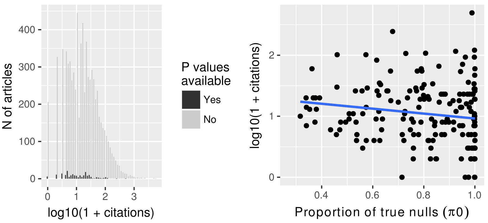

```{r setup, include=FALSE}
options(htmltools.dir.version = FALSE)
library(tidyverse)
```

class: inverse, middle, center

# Sissejuhatus

---

## Müra vs signaal

- Uute teadmiste hankimine sõltub tehniliselt sellest kui edukalt õnnestub andmete mürast signaal ülesse leida  

- See kehtib ka oomika ekperimentide korral, kus viiakse läbi paraleelselt tuhandeid mõõtmisi ja detekteeritakse samuti kuni tuhandeid efekte      

- väike osa leitud efektidest on tõelised ja teaduslikult huvitavad. Kuidas teha vahet mis on mis?     

---

## Top table

- Seoses teaduspublikatsioonide kallutatusega, kus teavitatakse ainult nn "edukatest" eksperimentidest, presenteeritakse ka oomika eksperimente teaduspublikatsioonides peamiselt nn. *top* tabelitena artikli lisades, kus on välja toodud mingi väike hulk enim muutunud tunnuseid/geene või geene mida teadlased on suutnud mingilgi moel interpreteerida ja oma mudelisse sobitada

- Peamiseks tulemuseks on üks-kaks geeni, mis on "edukalt" läbinud ka valideerimise ortogonaalsetes katsetes    

--

- Tulemused tunduvad huvitavad..., kas tasuks replitseerida<sup>1</sup>? 
- Kuidas hinnata sellise eksperimendi kvaliteeti, kus on testitud paralleelselt tuhandeid hüpoteese?


.footnote[[1] Replitseerimine -- uute andmete korjamine kontrollimaks teaduslikke väiteid. Reprodutseerimine keskendub eelkõige andmete analüüsi korratavus. Reprodutseeritavus toetab, kuid ei taga teaduslike väidete paikapidavust.]

---

## QC checklist

- Reprodutseeritavus: kas andmed on reanalüüsiks kasutatavad   

- Vastavus (NIH GEO) andmebaasi deponeerimise reeglitega?     

- Kui palju (GEO) andmesette sisaldab ka P väärtuste tabeleid?     

- P histogrammid – kui palju katseid on hästi/halvasti disainitud või analüüsitud?

---

class: inverse, middle, center

# P väärtused

---

## P väärtused on ühtlase jaotusega

- P väärtused on disainitud olema ühtlase jaotusega, selleks et kontrollida valepositiivsete arvu ehk tüüp 1 viga

--

- Juhuslike P väärtuste jaotus tuleneb [järgmisest seosest](https://stats.stackexchange.com/questions/10613/why-are-p-values-uniformly-distributed-under-the-null-hypothesis#10617), tingimusel kui T on juhuslik muutuja kumulatiivse jaotusega $F(T) \equiv Pr(T<t)$:

$$Pr(P<p) = Pr(F(T)<p) = Pr(T<F^{-1}(p)) = F(F^{-1}(p)) = p$$

--

- Ühtlase jaotuse eeldused:
      - nullhüpotees kehtib
      - tegemist on pideva jaotusega

---

## Test statistik pidevast jaotusest

Jaotuse kuju ei määra mitte hüpotees vaid parameetrid ([Murdoch, 2008](https://www.tandfonline.com/doi/abs/10.1198/000313008X332421))

$$H_0: \mu \le 0 \\ H_a: \mu \gt 0$$

```{r, echo=FALSE, out.width='60%', fig.align='center'}
knitr::include_graphics("img/murdoch2008-fig2.png")
```

---

## Test statistik diskreetsest jaotusest 

```{r, echo=FALSE, out.width='60%', fig.align='center'}
knitr::include_graphics("img/murdoch2008-fig3.png")
```

---

## P väärtuste jaotus 

```{r, echo=FALSE, fig.align='center'}
h1 <- replicate(200, t.test(rnorm(3, 1, 0.3))$p.value)
ggplot(data = data_frame(h0 = runif(2000), h1 = c(h1, runif(1800)))) +
  geom_histogram(aes(h1), bins = 30, center = 0.5) +
  geom_histogram(aes(h0), bins = 30, center = 0.5, fill = "gray", alpha = 0.7) +
  labs(x = "P väärtus", 
       y = "N",
       caption = "Hall, kui nullhüpotees kehtib, tõelisi efekte ei ole. Must, 10% tõelisi efekte ja statistiline jõud 80%.")
```


---

background-image: url(http://varianceexplained.org/figs/2014-12-15-interpreting-pvalue-histogram/plot_melted-1.png)
class: center, bottom

.footnote[
Pilt: Tüüpilised P väärtuste histogrammid 
@[Variance explained](http://varianceexplained.org/statistics/interpreting-pvalue-histogram/).
]

???

Image credit: [Variance explained](http://varianceexplained.org/statistics/interpreting-pvalue-histogram/)

---

background-image: url(img/ncbi-geo.png)
background-size: cover
class: middle, center


# Sekveneerimisandmed NIH Entrez andmebaasis

---

## HT-seq andmekogude arv NIH andmebaasis kasvab kiiresti

- Me otsisime NCBI GEO andmebaasist andmesette kasutades otsingusõna 
`"expression profiling by high throughput sequencing"
- Tulemuseks leidsime 13575 andmekogu, millest esimene publitseeriti 2006-09-08
- 68% GEO andmekogudest (9194) sisaldavad inimese või hiire järjestusi

```{r, echo=FALSE, out.width='60%', fig.align='center'}
knitr::include_graphics("img/fig1.png")
```

---

## GEO andmebaasi reeglid

- GEO arhiivil on kolm kohustuslikku komponenti: 
      1. metaandmed, 
      1. protsessitud andmed 
      1. toorandmed

- Protsessitud andmed sisaldavad minimaalselt näiteks kas toor või normaliseeritud sekventside arvu, või ChIP-Seq eksperimentide korral nn. piigifaile (peak files)

---

## Publitseerimine ja lisafailid

- 88% inimese või hiire andmekogudest on seotud ka primaarse publikatsiooniga 
      - Teiste mudelorganismide puhul on see protsent mõnevõrra madalam: 78%
      
- Peaaegu kõik GEO andmekogud (13560/13575) sisaldavad lisafaile (supplementary files)

- Neid väheseid andmekogusid, millel puuduvad ülesse laaditud lisafailid, publitseeritakse vaatamata sellele küllalt hästi 73% publication rate (95%CI, 44.9% to 92.2%) which is similar to data sets with supplementary files.


---

## Kõige tavalisemad lisafilinimed

- 'RAW.tar' arhiiv ja sellega seotud 'filelist.txt' on kõige tavalisemad
- 'RAW.tar' sisaldab ühte faili proovi kohta ja need failid on üle failinime seotud metaandmetega
- Teised tavalisemad failinimed on annotatsioonid, 'readme.txt' ja protsessitud andmed: tavaliselt sekventsi arvud, geeniekspressiooni analüüsi tulemused (P väärtused!) ja ChIP-Seq *peak counts*id.

```{r, echo=FALSE, out.width='75%', fig.align='center'}
knitr::include_graphics("img/fig2.png")
```

---

## Missugused failid sisaldavad P väärtuseid?

Praktilistest kaalutlustest lähtuvalt ei tahtnud me kõiki oma seti 34136 GEO lisafaili alla laadida. Pidime tegema valikuid.

- Sekventsijärjestuste arvu esitatakse lisafailides kas toorandmetena (positiivsed täisarvud, diskreetne jaotus) või juba normaliseerituna (pidev jaotus) 
      - HT-seq andmete põhjal analüüsitakse geeniekspressiooni tavaliselt kasutades toorandmeid 
      - Normaliseeritud andmeid kasutatakse ainult visualiseerimiseks, kuid need ei sobi differentiaalse ekspressiooni analüüsi reprodutseerimiseks

> Sellised tablid mis sisaldavad juba eksprssioonianalüüsi tulemusi koos adjusteerimata P väärtustega võimaldavad otsest kvaliteedi kontrolli

- Me välistasime pildifailid, binaarsed failid vms. failiformaadid mille puhul võis ennustada, et see ei sisalda kindlasti P väärtusi 

---

## Filter

- Failide filtreerimine vähendas failide arvu ~60% ja GEO seeriate arvu 51%   
   
- Alla laadidav andmesett koosnes 13526 failist 6660 GEO seeriast

```{r, echo=FALSE, fig.align='center'}

```

.footnote[Arrows from left to right, (1) GEO sets with supplementary files, (2) filter out RAW.tar and filelist.txt files from supplementary file names, (3) supplementary files with flat table formats that were downloaded, (4) tables with p values. Number of p value sets is the number of sets with >4000 features.]

---

class: inverse, middle, center

# Tulemused

---

## Size of the submitted datasets

- Mean number of samples was 27 and median 8. Most frequent sample size was 6. 
- Mean number of features was 41935 and median 21899 

```{r, echo=FALSE, fig.align='center'}

```

---

## Number of true nulls

```{r, echo=FALSE, fig.align='center'}

```

---

## Top ajakirjad mis publitseerivad HT-seq katseid

```{r, echo=FALSE, fig.align='center'}
knitr::include_graphics("img/fig8.png")
```

---

## Kas tsiteeritavus on seotud katse õnnestumisega

```{r, echo=FALSE, fig.align='center'}

```

---

##  Summary of histogram types in supplementary files of GEO HT-seq submissions

```{r, echo=FALSE, fig.align='center'}

```

---

## Ebainformatiivsete geenide filtreerimine parandab histogrammide kvaliteeti

- [Tabel](spark.html)


